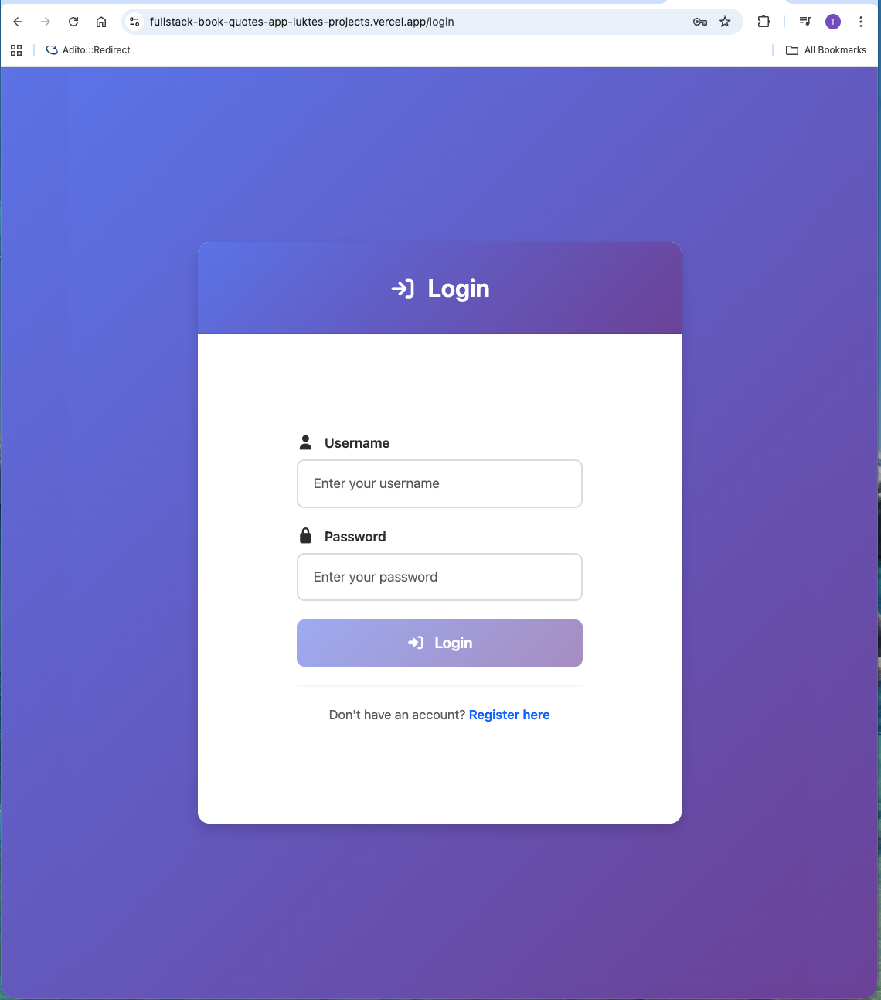
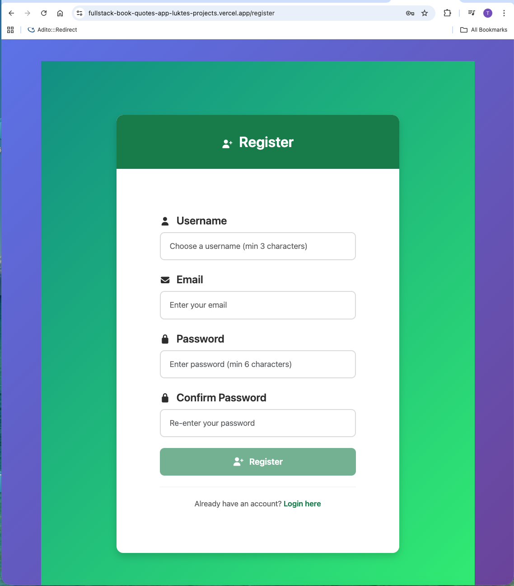
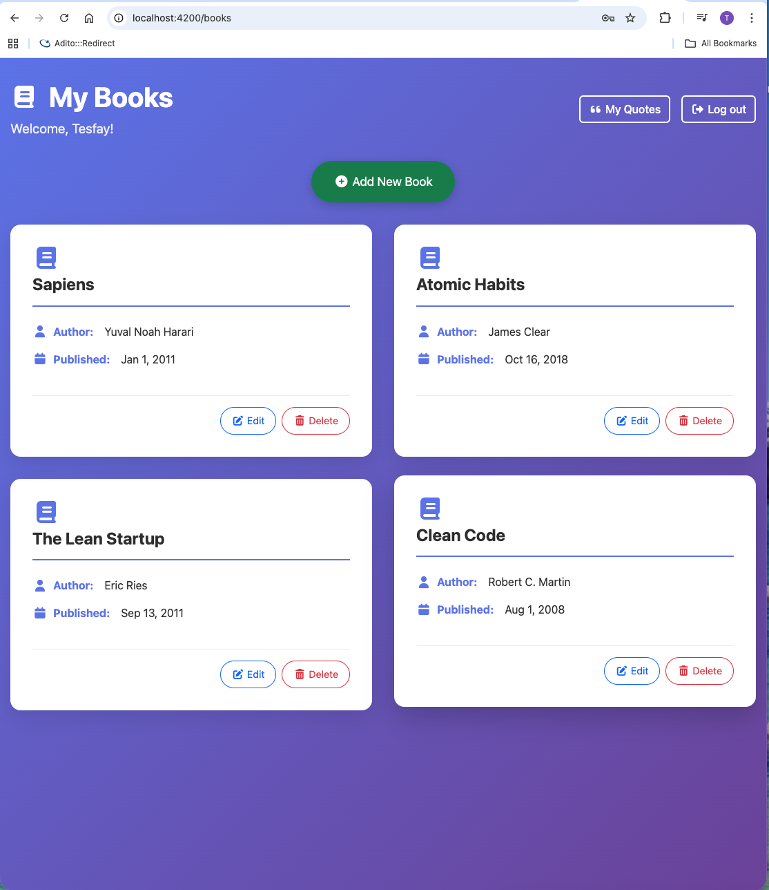
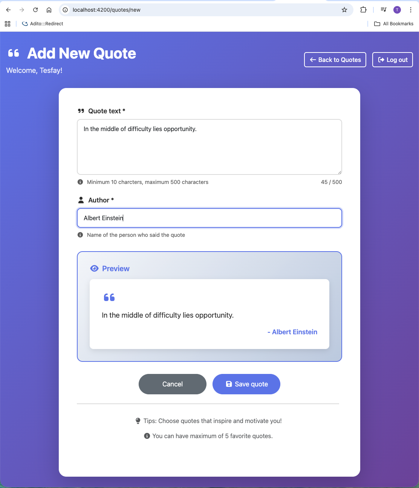
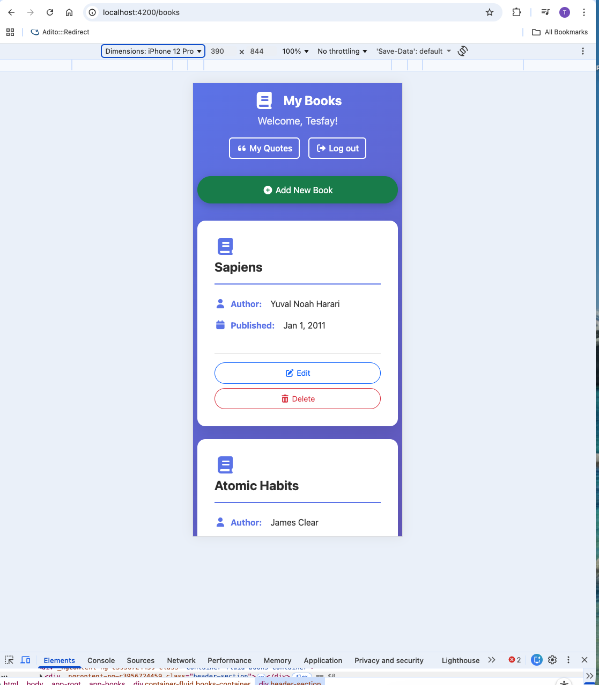

# Booki and Quotes Manager

A full-stack web application for managing books and favorite quotes with user authentication.

## Features

- 📚 **Book Management**: Create, read, update, and delete books
- 💬 **Quotes Management**: Save up to 5 favorite quotes
- 🔐 **User Authentication**: JWT-based authentication
- 📱 **responsive Design**: Works on desktop, tablet, and mobile
- 🎨 **Modern UI**: Beautiful gradient background with Bootstrp styling

## Teck Stack

### Frontend
- Angular 18
- TypeScript
- Bootstrap 5
- Font Awesome

### Backend
- Node.js
- Express.js
- MongoDB with Mongoose
- JWT Authentication
- bcrypt for password hashing

## Installation

### Prerequisites
- Node.js (v18+)
- MongoDB
- Angular CLI

### Backend Setup
```bash
cd backend
npm install
# Create .env file with MONGODB_URI and JWT_SECRET
npm start
```

### Frontend Setup
```bash
cd frontend
npm install
ng serve --no-ssr
```

## API Endpoints

### Authentication
- POST `/api/auth/register` - Register new user
- POST `/api/auth/login` - Login user

### Books
- GET `/api/books` - Get all user's books
- POST `/api/books`- Create new book
- PUT `/api/books/:id`- Update existing book
- DELETE `/api/books/:id`- Delete book

### Quotes
- GET `/api/quotes` - Get all user's books
- POST `/api/quotes/` - Create new quote
- PUT `/api/quotes/:id` - Update existing quote
- DELETE `/api/quotes/:id` - Delete quote


## Screenshots

### Login Page


### Register Page


### Books Management



### Quotes Management


### Book Form


### Quote Form


### Mobile View (Responsive Design)



## Author

Teklu Kibrom

## License

MIT
