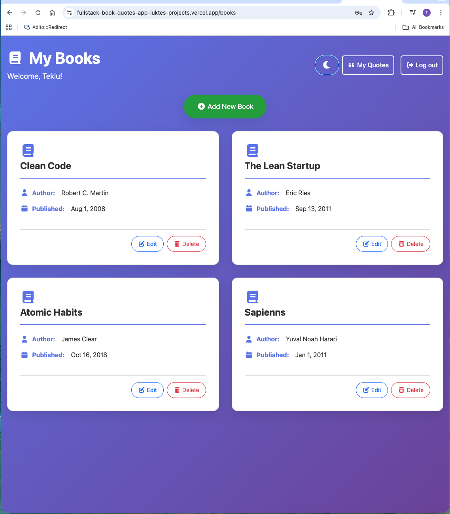
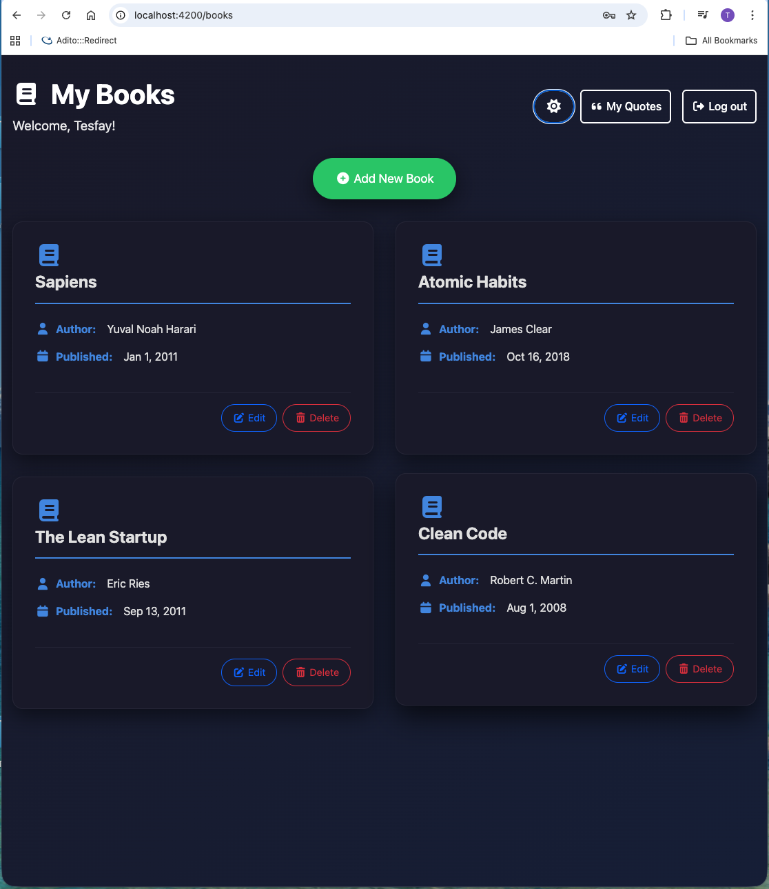
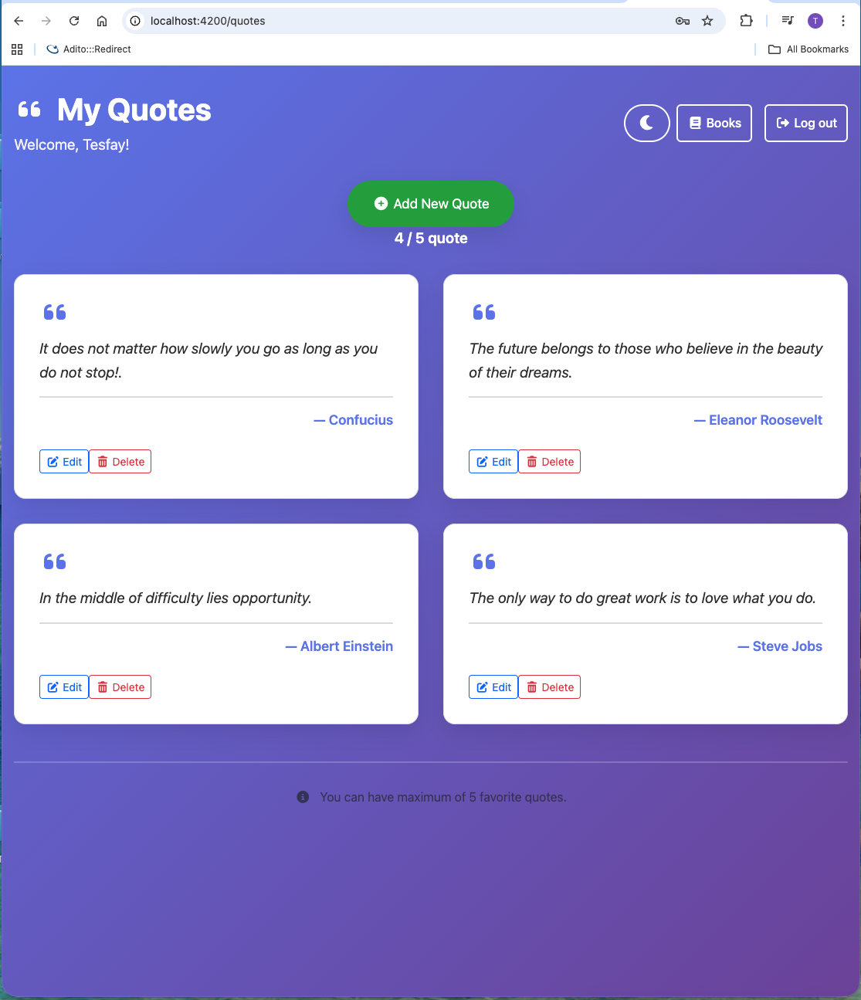
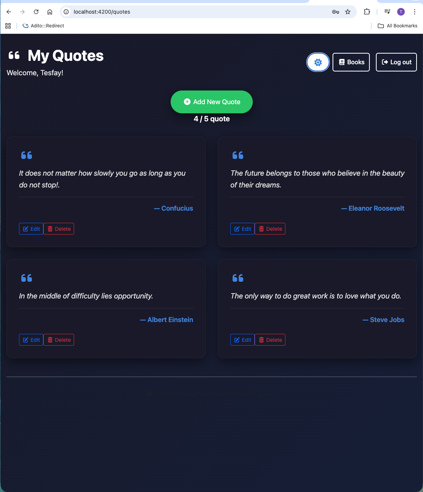
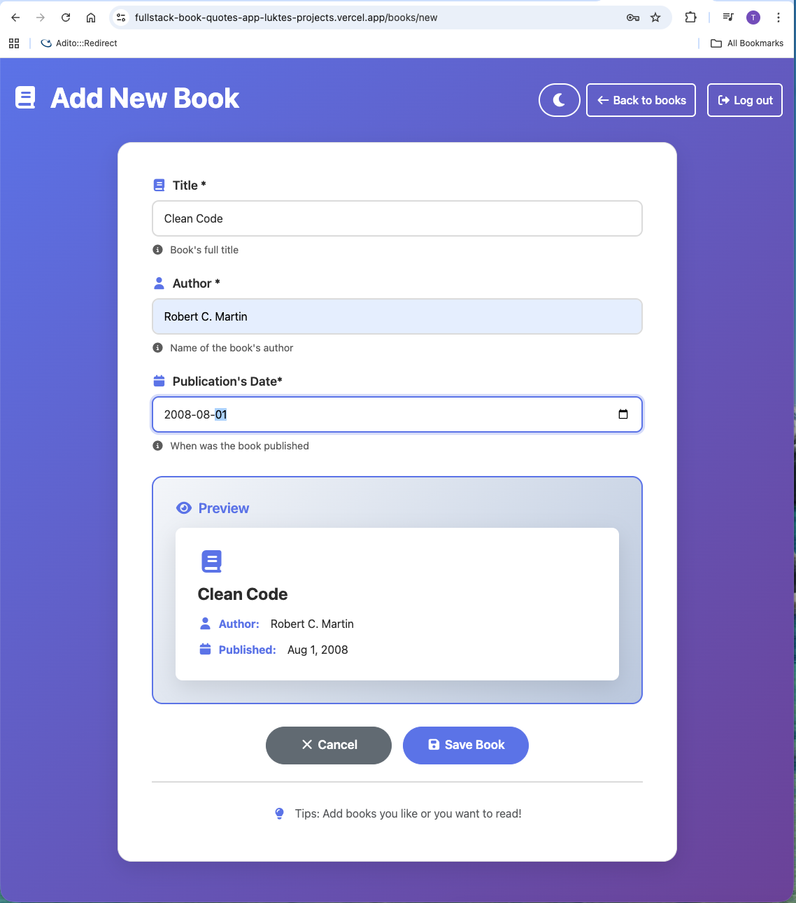
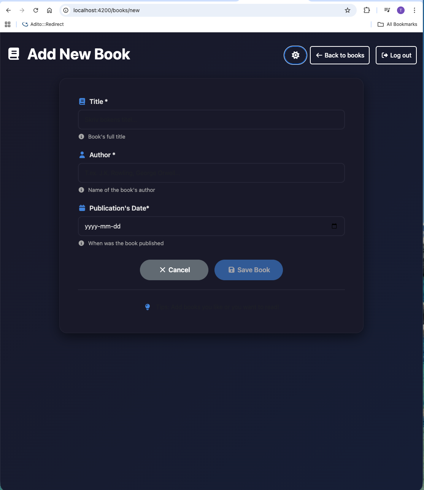
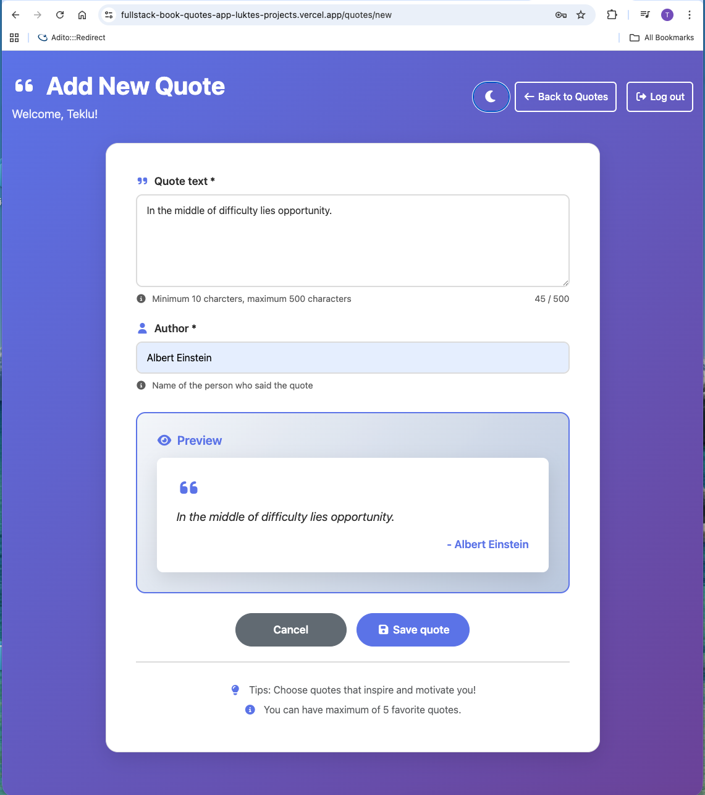
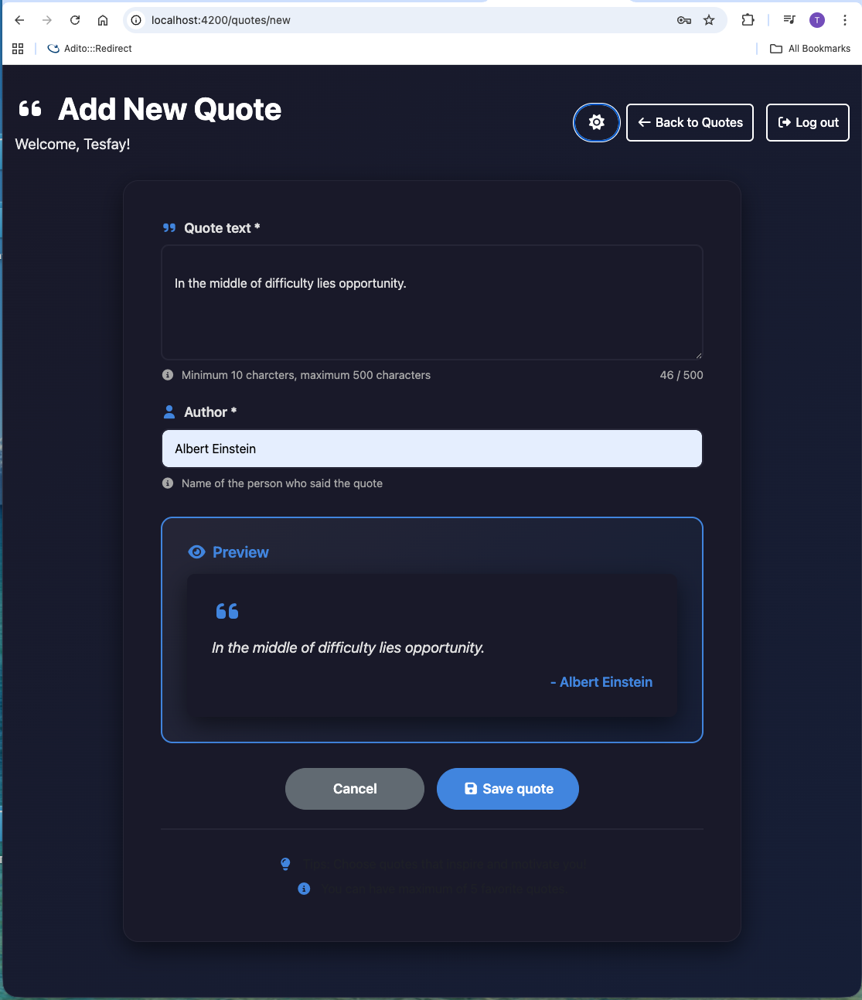
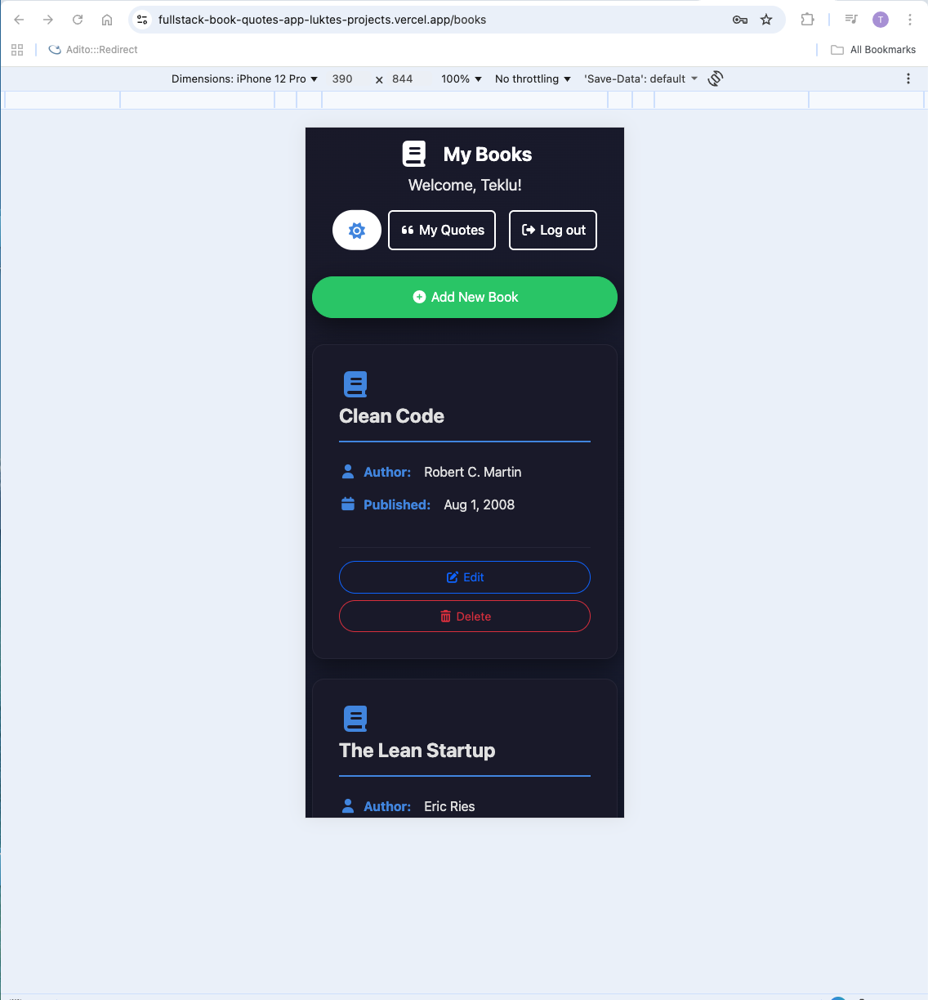

# Book and Quotes Manager

A full-stack web application for managing books and favorite quotes with user authentication.

## 🚀 Live Demo
**[View Live Application](https://fullstack-book-quotes-app-luktes-projects.vercel.app)**

- **Frontend:** Deployed on Vercel
- **Backend:** Deployed on Render
- **Database:** MongoDB Atlas

## Features

- 📚 **Book Management**: Create, read, update, and delete books
- 💬 **Quotes Management**: Save up to 5 favorite quotes
- 🔐 **User Authentication**: JWT-based authentication
- 📱 **responsive Design**: Works on desktop, tablet, and mobile
- 🎨 **Modern UI**: Beautiful gradient background with Bootstrp styling

## Teck Stack

### Frontend
- Angular 18
- TypeScript
- Bootstrap 5
- Font Awesome

### Backend
- Node.js
- Express.js
- MongoDB with Mongoose
- JWT Authentication
- bcrypt for password hashing

## Installation

### Prerequisites
- Node.js (v18+)
- MongoDB (local) or MongoDB Atlas account
- Angular CLI (`npm install -g @angular/cli`)

### Local Development Setup

#### 1. Clone the repository
```bash
git clone https://github.com/Lukte/Fullstack-book-quotes-app.git
cd Fullstack-book-quotes-app
```

#### 2. Backend Setup
```bash
cd backend
npm install
```

Create a `.env` file in the `backend/` directory:
```env
MONGODB_URI=mongodb://localhost:27017/bookquotes
JWT_SECRET=your-secret-key-here
```

Start the backend:
```bash
npm start
# Server runs on http://localhost:3000
```

#### 3. Frontend Setup
```bash
cd frontend
npm install
ng serve --no-ssr
# App runs on http://localhost:4200
```

### Production Deployment

#### Backend (Render/Railway)
1. Create account on Render.com
2. Connect your GitHub repository
3. Set root directory to `backend`
4. Add environment variables: `MONGODB_URI` and `JWT_SECRET`
5. Deploy

#### Frontend (Vercel/Netlify)
1. Update `frontend/src/environments/environment.prod.ts`:
```typescript
export const environment = {
  production: true,
  apiUrl: 'https://your-backend-url.onrender.com'
};
```

2. Create account on Vercel.com
3. Connect your GitHub repository
4. Set root directory to `frontend`
5. Deploy

## API Endpoints

### Authentication
- POST `/api/auth/register` - Register new user
- POST `/api/auth/login` - Login user

### Books
- GET `/api/books` - Get all user's books
- POST `/api/books`- Create new book
- PUT `/api/books/:id`- Update existing book
- DELETE `/api/books/:id`- Delete book

### Quotes
- GET `/api/quotes` - Get all user's books
- POST `/api/quotes/` - Create new quote
- PUT `/api/quotes/:id` - Update existing quote
- DELETE `/api/quotes/:id` - Delete quote


## Screenshots

### Login Page


### Register Page


### Books Management





### Quotes Management




### Book Form



### Quote Form



### Mobile View (Responsive Design)




## 🌐 Deployment

### Frontend (Vercel)
- **URL:** https://fullstack-book-quotes-app-luktes-projects.vercel.app 
- **Framework:** Angular 18
- **Auto-deploys:** On push to main branch


### Backend (Render)
- **URL:** https://book-quotes-backend-6h99.onrender.com
- **Framework:** Node.js + Express
- **Auto-deploys:** On push to main branch


### Database (MongoDB Atlas)
- **Cloud Database:** Free tier (M0)
- **Region:** EU (Frankfurt)

## Author

Teklu Kibrom

## License

MIT
